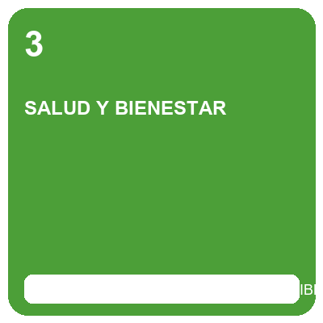
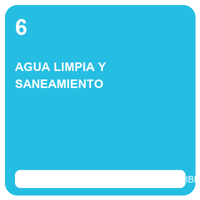
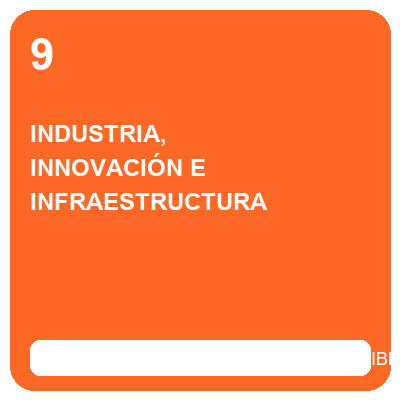
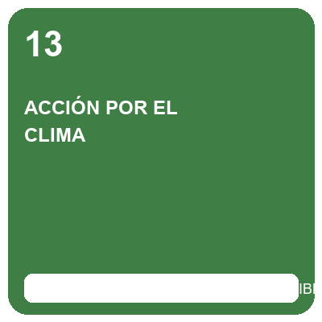
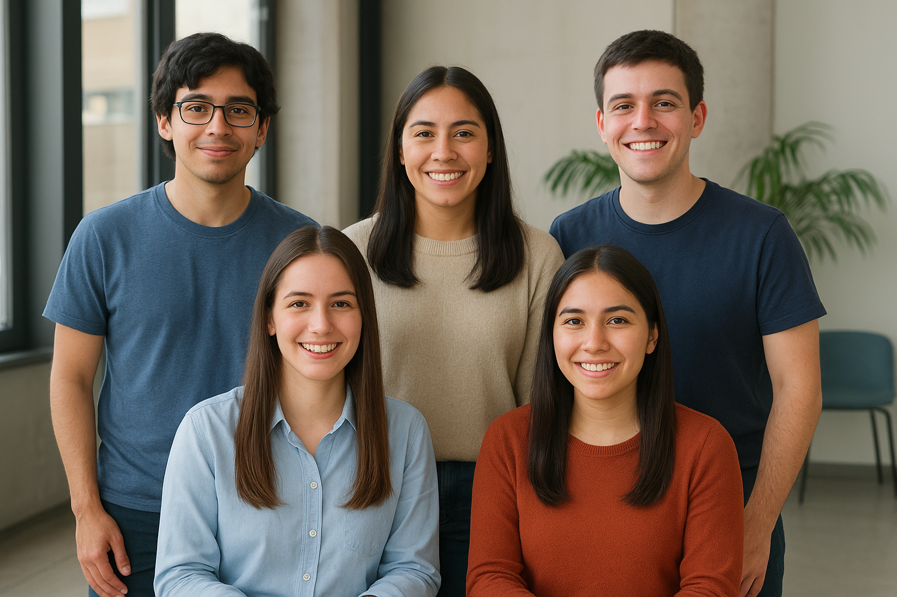
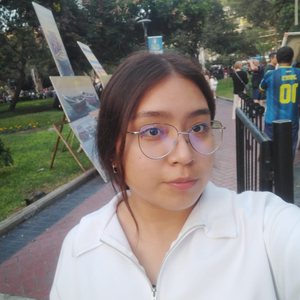
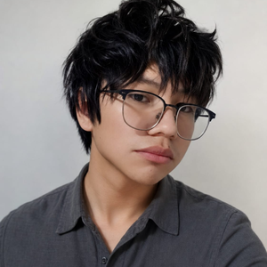

# Equipo 10 - [Aquí va el Nombre del Curso]
### Carrera de Ingeniería Ambiental / Informática / Industrial  
**Universidad Peruana Cayetano Heredia**

---

## 🌍 Descripción del Equipo 
Somos el **Equipo 10** del curso **[Aquí va el Nombre del Curso 202X-1]**, conformado por estudiantes de las carreras de Ingeniería Ambiental, Informática e Industrial.  
Nuestro objetivo es aplicar la metodología de diseño para generar soluciones innovadoras con impacto social, tecnológico y ambiental.  

---

## 🎯 Objetivos de Desarrollo Sostenible (ODS)
*(Aquí van los Objetivos de Desarrollo Sostenible seleccionados para el proyecto)*

  
  
  
  
  

Nos interesa trabajar en los siguientes **Objetivos de Desarrollo Sostenible (ODS):**  
- **ODS 3:** Salud y Bienestar  
- **ODS 9:** Industria, Innovación e Infraestructura  
- **ODS 11:** Ciudades y Comunidades Sostenibles  
- **ODS 12:** Producción y consumo responsable  

---

## 📸 Fotografía del Equipo  

  <!-- AQUÍ VA LA FOTOGRAFÍA GENERAL DEL EQUIPO COMPLETO -->
  
   
  <em>Figura 1. Fotografía del Equipo 10</em>

---

## 👥 Integrantes del Equipo  
*(Aquí van los nombres, fotografías, roles e intereses de cada integrante)*

| Foto | Nombre | Rol | Intereses |
|:---:|--------|-----|-----------|
|  | **Katherine** | Líder del equipo | Innovación social, sostenibilidad y gestión de proyectos |
|  | **Lucero** | Responsable de investigación | Gestión ambiental, desarrollo comunitario |
|  | **Mao** | Programador / Modelador | Programación, análisis de datos, simulación |
|  | **Renzo** | Diseñador / Encargado de documentación | Diseño de prototipos, comunicación científica y redacción técnica |

> ℹ️ *Nota: La información detallada y los archivos de imagen se gestionan en el directorio [`FOTOS NOMBRES Y DEMAS INFORMACION`](./FOTOS%20NOMBRES%20Y%20DEMAS%20INFORMACION/INFO.README).*

---

## 📌 Resumen Final  
Este README resume quiénes somos, qué nos motiva y en qué ODS queremos enfocar nuestro trabajo durante el curso.  
