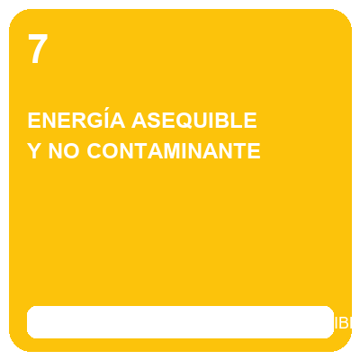
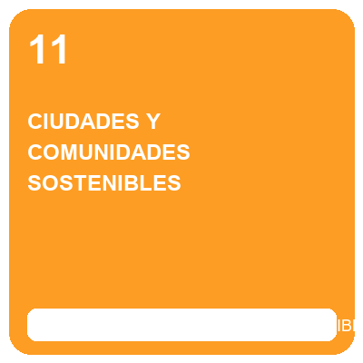
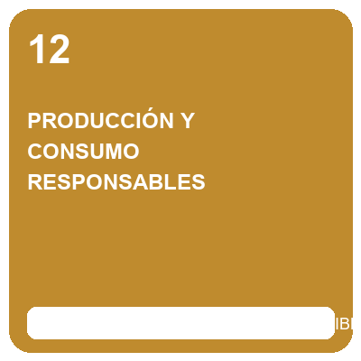
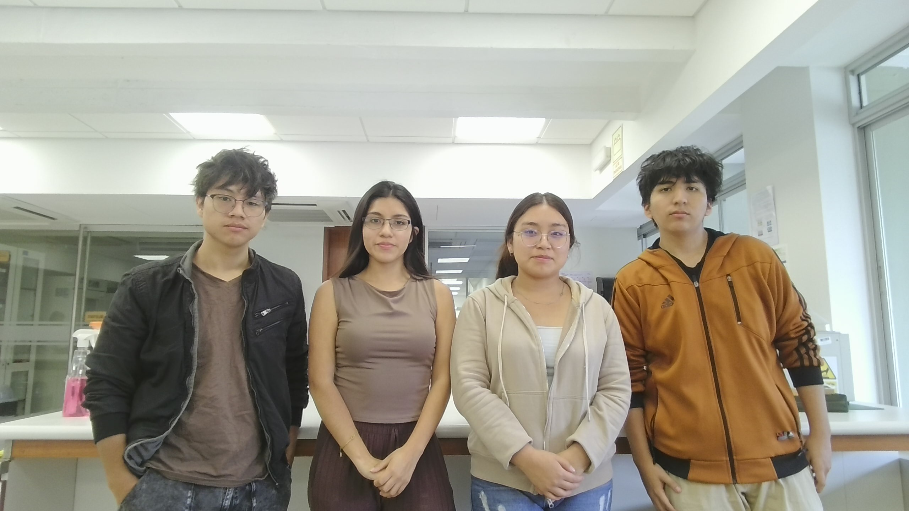
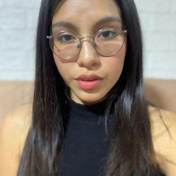
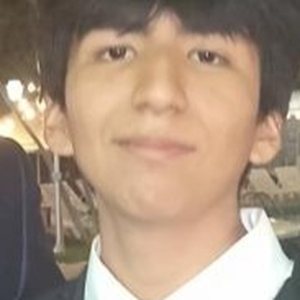

# Equipo 10 - Fundamentos de Diseño
### Carrera de Ingeniería Informática / Industrial
**Universidad Peruana Cayetano Heredia**

---

## 🌍 Descripción del Equipo
Somos el **Equipo 10** del curso **Fundamentos de Diseño 2026-2**, conformado por estudiantes de las carreras de Ingeniería Informática e Industrial.
Nuestro objetivo es aplicar la metodología de diseño para generar soluciones innovadoras con impacto social, tecnológico y ambiental.

---

## 🎯 Objetivos de Desarrollo Sostenible (ODS)
*(Aquí van los Objetivos de Desarrollo Sostenible seleccionados para el proyecto)*

  
  
  

Nos interesa trabajar en los siguientes **Objetivos de Desarrollo Sostenible (ODS):**
- **ODS 7:** Energía Asequible y No Contaminante
- **ODS 11:** Ciudades y Comunidades Sostenibles
- **ODS 12:** Producción y Consumo Responsables

---

## 📸 Fotografía del Equipo

  

---

## 👥 Integrantes del Equipo
*(Aquí van los nombres, fotografías, roles e intereses de cada integrante)*

| Foto | Nombre | Rol | Intereses |
|:---:|--------|-----|-----------|
|  | **Mao Arceni, Capcha Pumacahua** | Líder del equipo | Programación, análisis de datos, simulación |
|  | **Cruz Oyarce Katherine Jireh** | Encargado de documentación | comunicación científica y redacción técnica |
|  | **Lucero Sofía Tarazona Gonzales** | Responsable de investigación | Gestión ambiental, desarrollo comunitario |
|  | **Renzo Jair Cruz Vega** | Diseñador | Diseño de prototipos, creatividad aplicada |
|  | **Julio Maguiña** | --- | --- |

---

## 📌 Resumen Final
Este README resume quiénes somos, qué nos motiva y en qué ODS queremos enfocar nuestro trabajo durante el curso.
